# Abeychain Grant Delivery

## `Milestone 1` — Integrating into the Bridge Components
| Deliverable |
|-|
| 1. [Validation](#11-validation) - we have added the validation logic relevant for the Abey part of the bridge 2. [NFT-Indexer](#12-nft-indexer) - we have developed search for NFTs by a user account  3. [TX fee estimation](https://github.com/XP-NETWORK/exchange-rate/search?q=abey) - we will integrate Abey to the TX fee estimator 4. [Heartbeat](#13-heartbeat) - we will plug Abey to the bridge heartbeat 5. [Testnet Node integration](https://github.com/XP-NETWORK/xpjs/blob/secretjs/src/consts.ts#L56) - we will plug to a node, start event listening and TX submission 6. [UI](#16-the-ui-testnet) - we will integrate Abey in the bridge UI 7. [Smart Contracts](https://github.com/XP-NETWORK/xpjs/blob/secretjs/src/factory/factories.ts#L138-L143) - we have deployed smart contracts on the testnet 8. [JS library](https://github.com/XP-NETWORK/xpjs/search?q=abey) - we have added Abey to the bridge|

### 1.1 `Validation`

Validation differs from one protocol to another. Additionally, there are chain-specific parameters set for every ledger in the validators.

### 1.2 `NFT Indexer`

NFT-Indexer is a bridge tool fetching the Non-fungible tokens by a user public key.

### 1.3 `Heartbeat`

Heartbeat is a tool checking liveliness of the chain RPC nodes, validators' funds are sufficient for transaction submission, and their responsiveness.

### 1.6 `The UI (Testnet)`

Not every NFT enthusiast is a coder. To support the non-coding community members the bridge is equipped with the sleek & intuitive UI.

#### 1.6.1 Abeychain is available as a departure or a destination chain

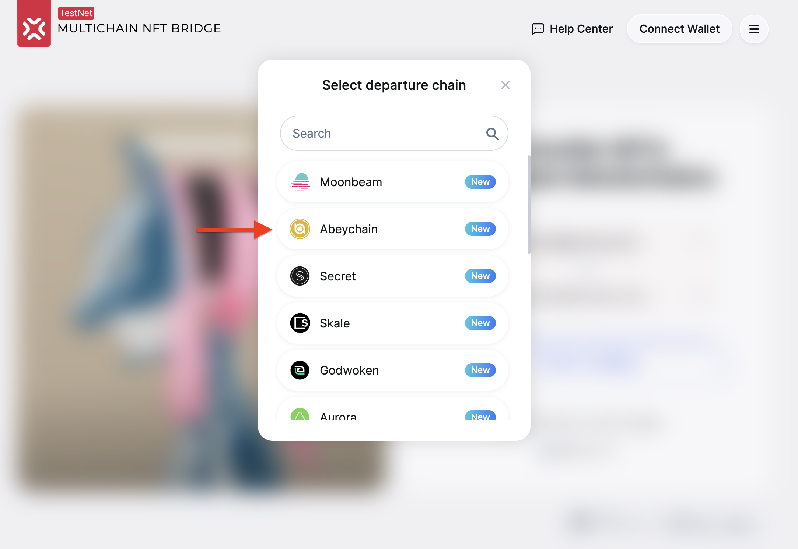

#### 1.6.2 NFT-Indexer in the bridge UI

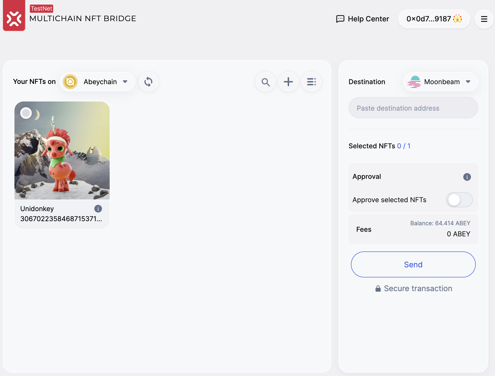

#### 1.6.3 Transaction fee estimation

In order to see the fee estimation on the chain of destination, select at least one NFT by clicking the top left corner of the NFT Card. The fee estimation is accompanied with the information about the sender's balance.

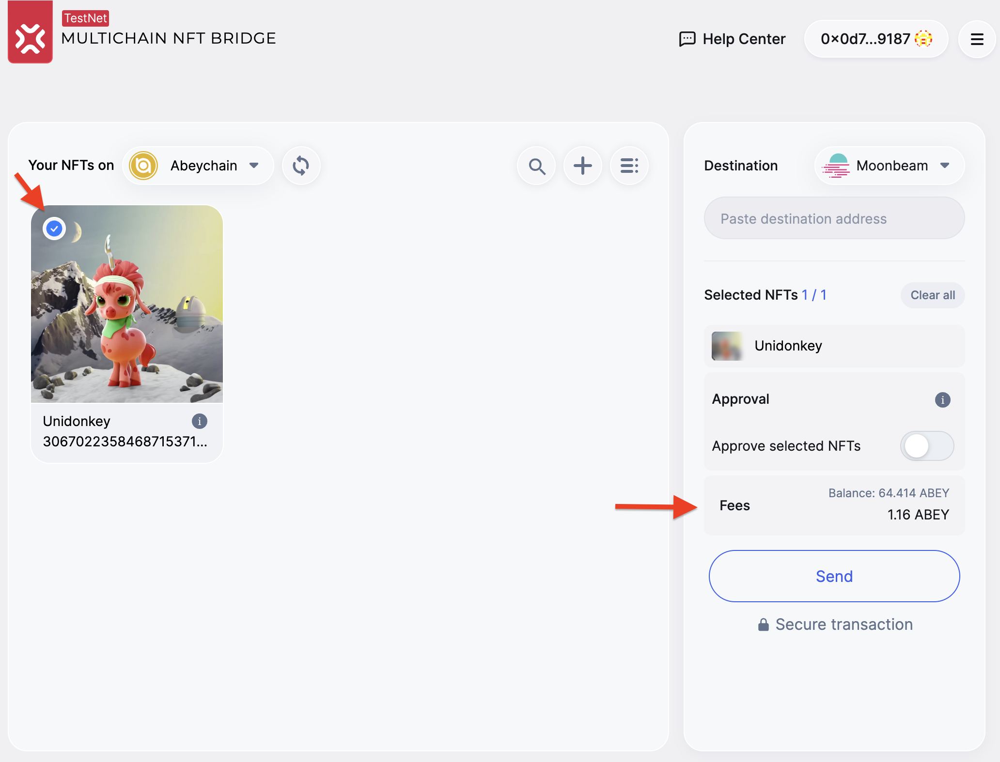

#### 1.6.4 Apporoval on Abeychain in the bridge

The prerequisites of calling the `approve` transaction are:
1. At least one NFT must be selected
2. The destination address field must be provided

To approve, slide the control to the right from the `Approve selected NFTs` label. 

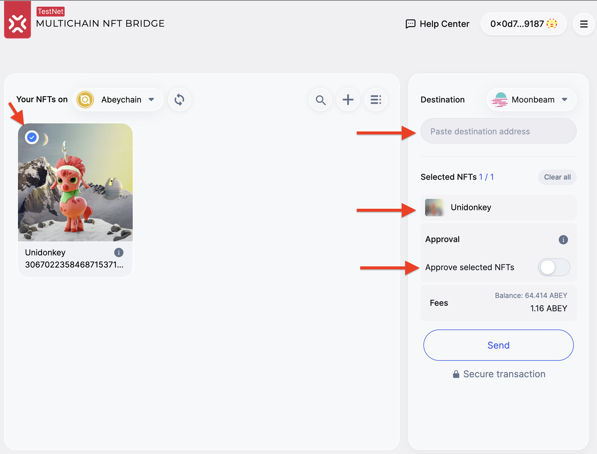

A Metamask pop-up window will appear suggesting the user to sign the transaction:

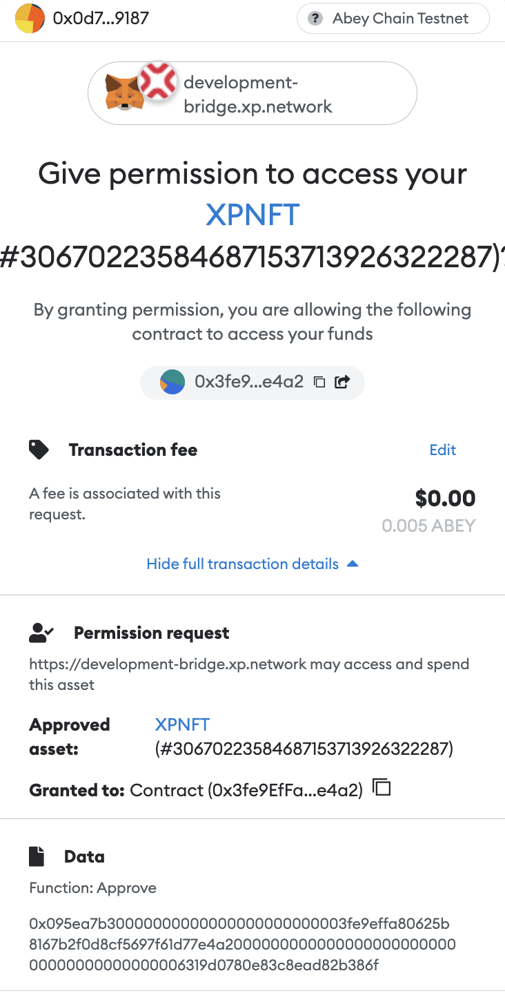

The spinner informes the user that the transaction is pending.

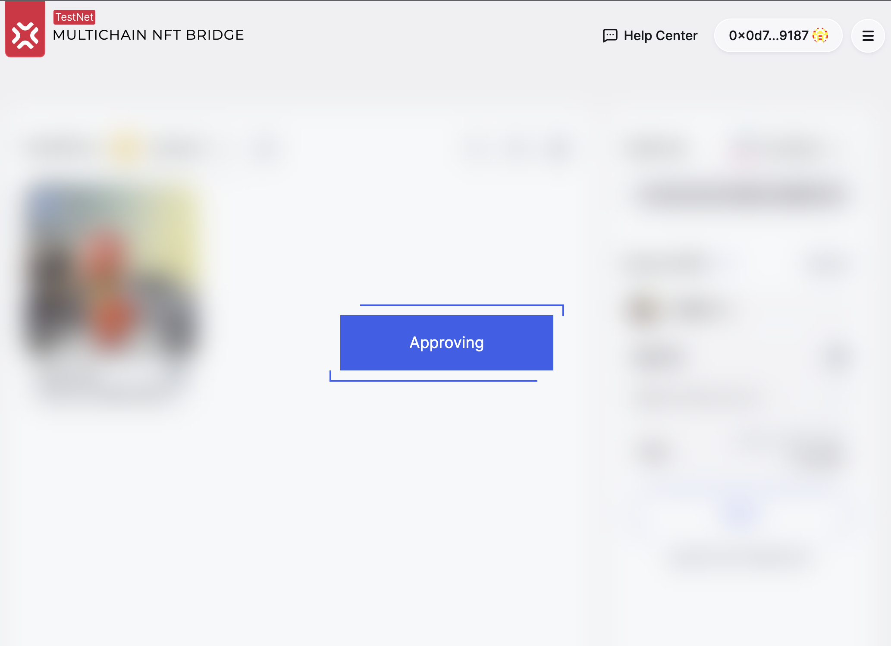

After a successful transaction the control will indicate that the bridging transaction has been approved, the `Send` button becomes available for interaction.

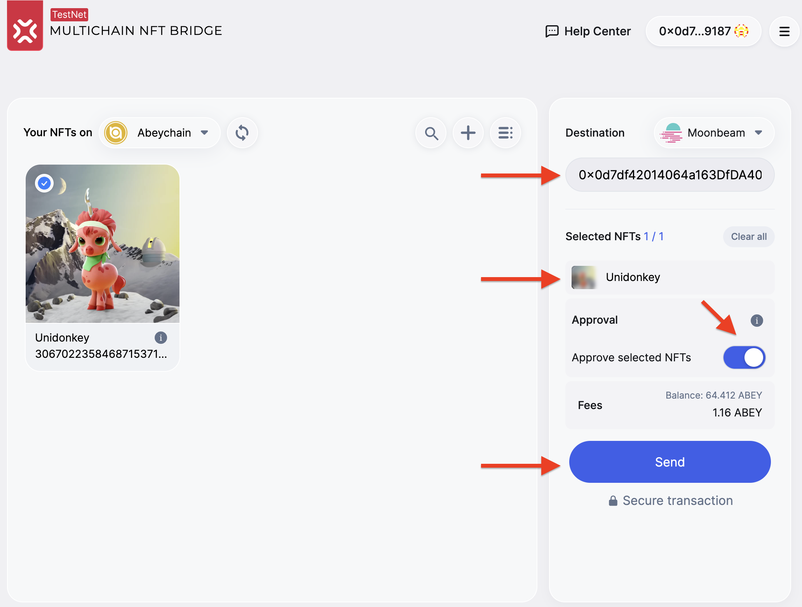

#### 1.6.5 transferring an NFT from Abeychain

Click the `Send` button to transfer an NFT from Abeychain to the chain indicated as `Destination`.

Sign the transaction in the wallet of your choice (Metamask, WalletConect, BitKeep).

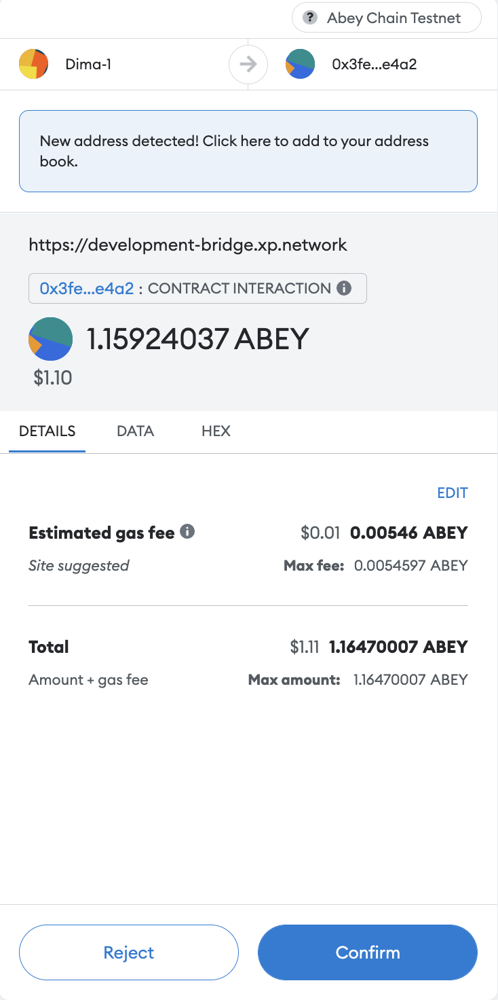

Once the transaction on the chain of origin is available, the `Bridging Results` pop-up window appears. The links are clickable, openning the corresponding chain explorer where the user account or transaction can be inspected in greater detail.

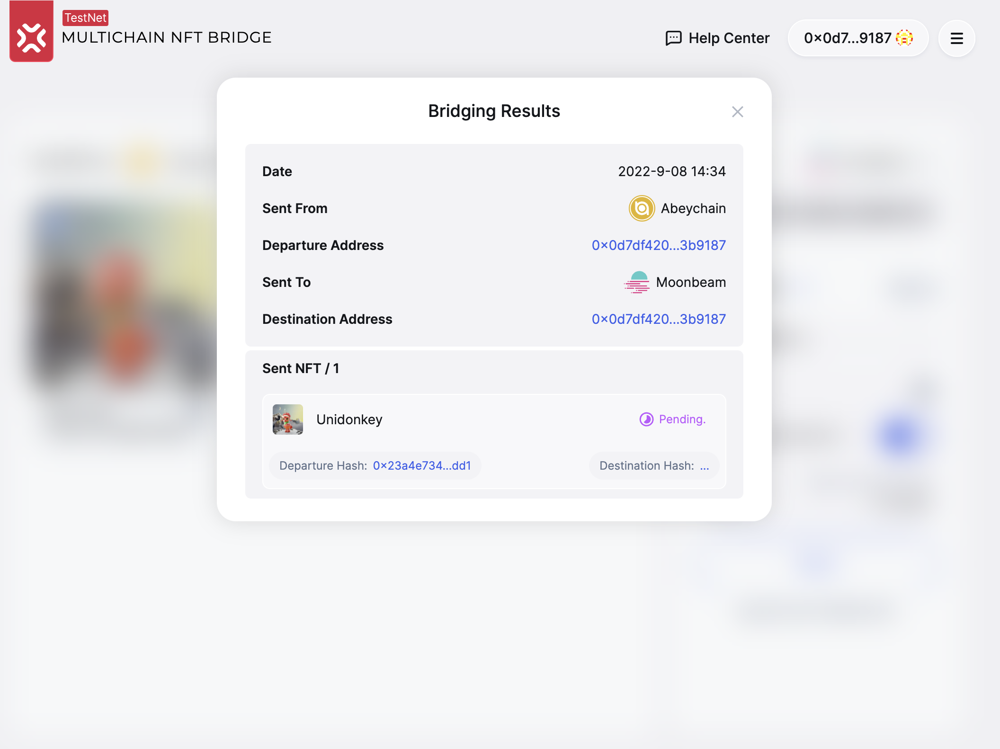

For example, the departure transaction https://testnet-explorer.abeychain.com/tx/0x23a4e7348bf279a56244e6e92e39bd8577ef56981529aab0b3b9fde6ad94add1 can be viewed on the chain like so:

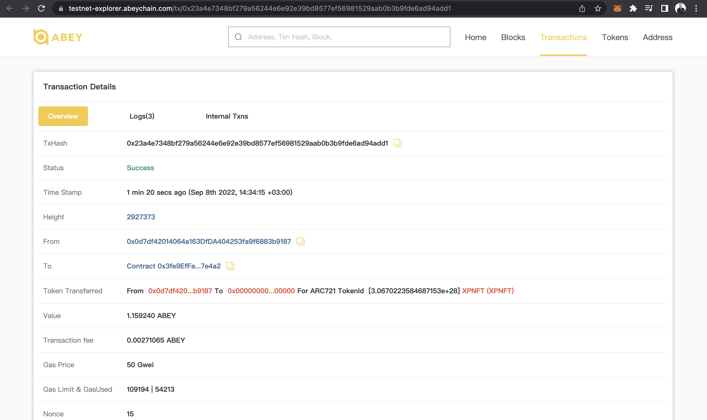

As a result of a successful transaction, the NFT must dissapear from the NFT Cards View like so:

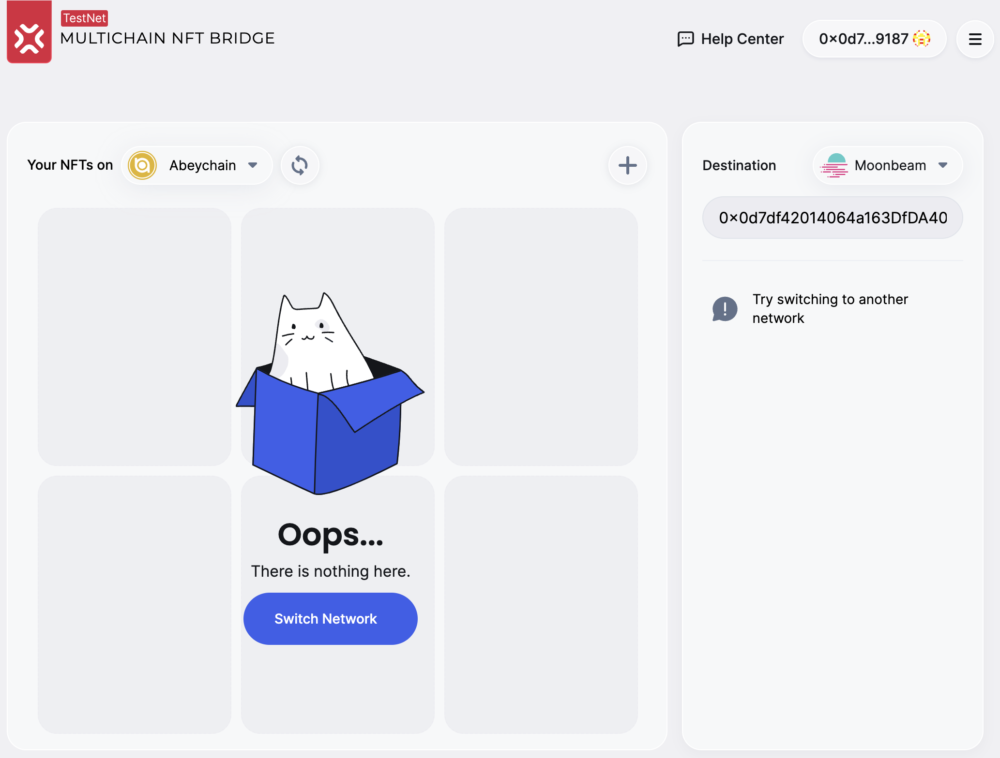

# TODO
## `Milestone 2` — Testing & Documenting

| Delivery Date | Deliverable | Specification |
|-|-|-|
| 2 weeks | Tests & Documentation | 1. Documentation - we will provide bridge documentation allowing to interact with the bridge UI and the JS library. 2. Unit-testing - The code will have proper unit-test coverage 85% to ensure functionality and robustness. 3. Testing SCs - We have deployed and test the contracts in the testnet environment|

## `Milestone 3` — Mainnet Integration

| Delivery Date | Deliverable | Specification |
|-|-|-|
| 2 weeks | Mainnet Integration | 1. Mainnet contract deployment - we have deployed smart contracts on the mainnet. 2. JS Library integration - we will integrate Abey in the  &nbsp;&nbsp;&nbsp;&nbsp;+ validators &nbsp;&nbsp;&nbsp;&nbsp;+ UI  &nbsp;&nbsp;&nbsp;&nbsp;+ NFT-Lister &nbsp;&nbsp;&nbsp;&nbsp;+ JS Library &nbsp;&nbsp;&nbsp;&nbsp;+ Widget &nbsp;&nbsp;&nbsp;&nbsp;+ Heartbeat   3. We will test that all the components properly work in the mainnet  4. We will make announcements about integrating Abey in the bridge|
