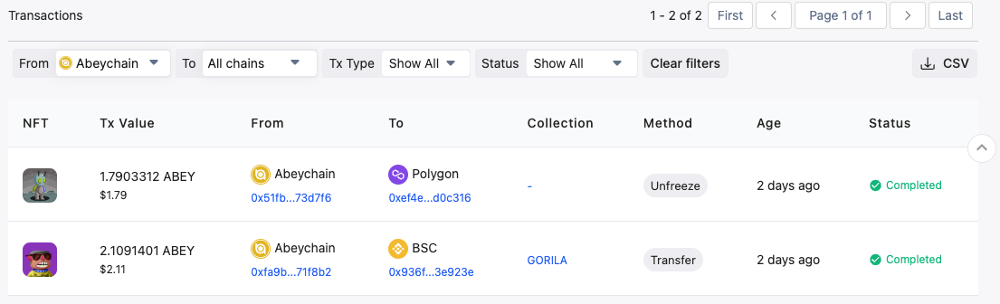
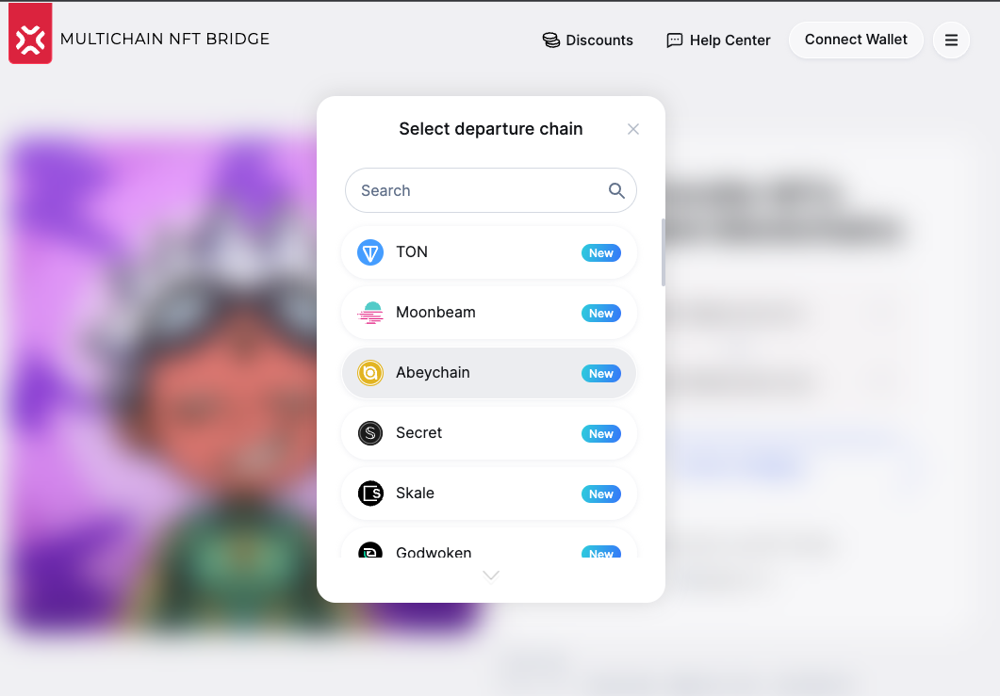
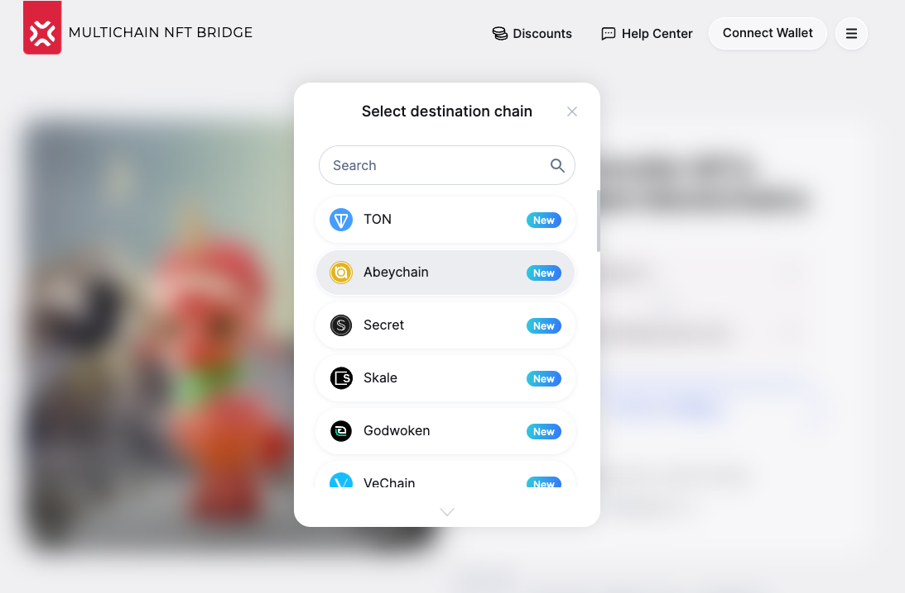
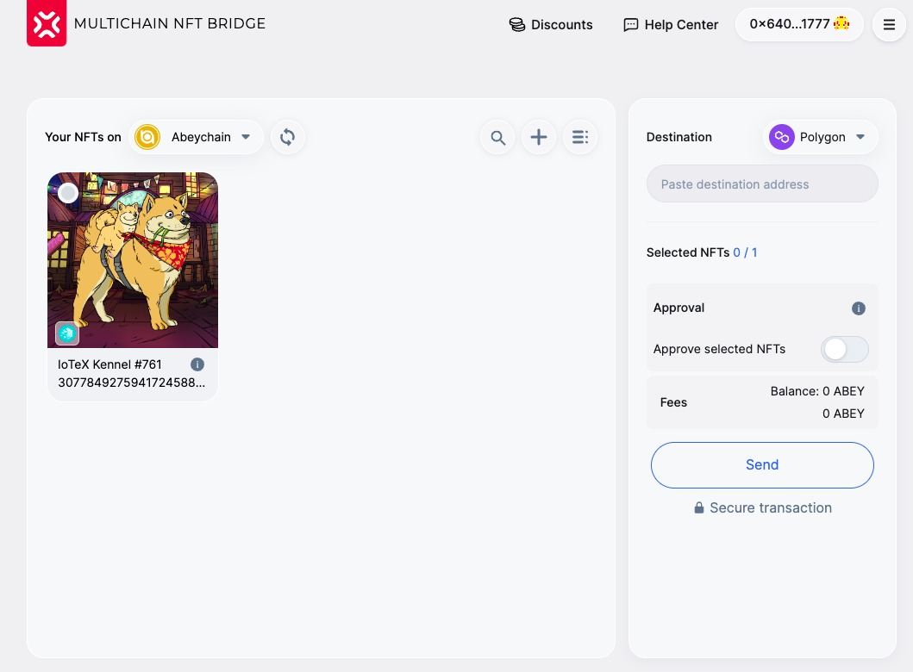
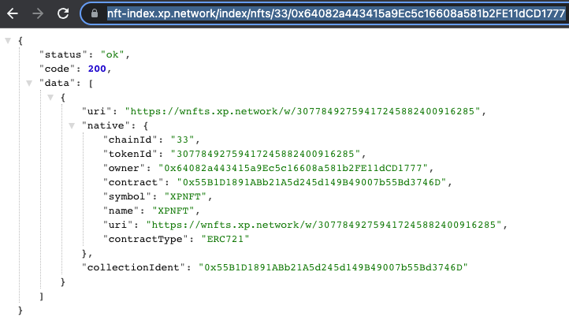
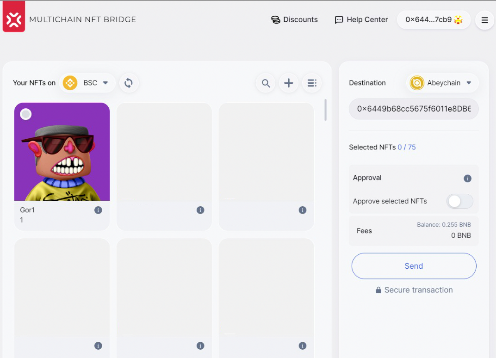

# Milestone 3 delivery proofs

## 1. Mainnet contract deployment - we have deployed smart contracts on the mainnet.

## 2. JS Library integration - we will integrate Abey in the

### 2.1 Validators

The bridge validators are an off-chain oracle network securing the transactions between chains. Their work can be proven by successful cross chain transactions:

### 2.2 UI

Abeychain is available as a departure chain:

Abeychain is available as a destination chain:

### 2.3 NFT-Indexer

NFT Indexing works with the Mainnet Abeychain:

API: https://nft-index.xp.network/index/nfts/33/0x64082a443415a9Ec5c16608a581b2FE11dCD1777

### 2.4 JS Library

### 2.5 Widget

### 2.6 Explorer

Abeychain bridge transactions are tracked by the bridge explorer:

Example: https://explorer.xp.network/tx/0xfa9b766f4441671589ae5eccd660c5ab0fc4847e4f01a024759114692371f8b2

## 3. We will test that all the components properly work in the mainnet

Sending from BSC TO Abeychain

FROM Abeychain: https://scan.abeychain.com/tx/0xfa9b766f4441671589ae5eccd660c5ab0fc4847e4f01a024759114692371f8b2

TO BSC: https://bscscan.com/tx/0x936f9fd76838814e6bd53e732a769884aa98d00feaadedb5255ff61b183e923e

## 4. We will make announcements about integrating Abey in the bridge