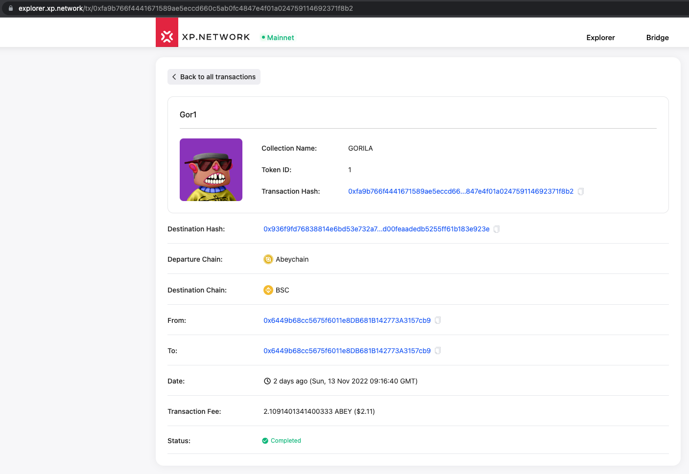

# Milestone 3 delivery proofs

## 1. Mainnet contract deployment 

Mainnet Staging:

|Contract Name|Contract Address|
|:-:|:-:|
|Bridge Contract|[0x14db0f56042Fa87F3b3921E871f87248f4C56A71](https://scan.abeychain.com/address/0x14db0f56042Fa87F3b3921E871f87248f4C56A71)|
|XPNFT ERC-721|[0x3C8C51809Ee58E9D3BA37e37112843e41DcBD7B7](https://scan.abeychain.com/address/0x3C8C51809Ee58E9D3BA37e37112843e41DcBD7B7)|
|XPNFT ERC-1155|[0x8776073043eef8929F4a9cBa8Aacc6B59A21BA52](https://scan.abeychain.com/address/0x8776073043eef8929F4a9cBa8Aacc6B59A21BA52)|
|Minter ERC721|[0xD580913Ef2c8CA4Ca90D4bE6851ACa004cf586D8](https://scan.abeychain.com/address/0xD580913Ef2c8CA4Ca90D4bE6851ACa004cf586D8)|
|Minter ERC1155|[0x5Ed657a379e06CBAc1Ba1a9cF6D28e71c66B0c83](https://scan.abeychain.com/address/0x5Ed657a379e06CBAc1Ba1a9cF6D28e71c66B0c83)|

Mainnet Production:

|Contract Name|Contract Address|
|:-:|:-:|
|Bridge Contract|[0x4ceDb46481d7118E1D292C318E37510E5919bBe6](https://scan.abeychain.com/address/0x4ceDb46481d7118E1D292C318E37510E5919bBe6)|
|XPNFT ERC-721|[0x55B1D1891ABb21A5d245d149B49007b55Bd3746D](https://scan.abeychain.com/address/0x55B1D1891ABb21A5d245d149B49007b55Bd3746D)|
|XPNFT ERC-1155|[0xF9DfD29ddEDEa3224f9c7E12c7Bbe37101341786](https://scan.abeychain.com/address/0xF9DfD29ddEDEa3224f9c7E12c7Bbe37101341786)|
|Minter ERC721|[0xBb5e9896cEe600DaC470775B6f235Db105E861BD](https://scan.abeychain.com/address/0xBb5e9896cEe600DaC470775B6f235Db105E861BD)|
|Minter ERC1155|[0x35c3c3959d19A310Fc052545fCC29200dc440CdA](https://scan.abeychain.com/address/0x35c3c3959d19A310Fc052545fCC29200dc440CdA)|

## 2. JS Library integration

### 2.1 Validators

The bridge validators are an off-chain oracle network securing the transactions between chains. Their work can be proven by successful cross chain transactions:

### 2.2 UI

Abeychain is available as a departure chain:

Abeychain is available as a destination chain:

### 2.3 NFT-Indexer

NFT Indexing works with the Mainnet Abeychain:

API: https://nft-index.xp.network/index/nfts/33/0x64082a443415a9Ec5c16608a581b2FE11dCD1777

### 2.4 JS Library

Mainnet Staging: https://github.com/XP-NETWORK/xpjs/blob/secretjs/src/factory/factories.ts#L440-L449

Mainnet Production: https://github.com/XP-NETWORK/xpjs/blob/secretjs/src/factory/factories.ts#L769-L778

### 2.5 Widget

Abeychain is accessable in the bridge widget:

### 2.6 Explorer

Abeychain bridge transactions are tracked by the bridge explorer:

Example: https://explorer.xp.network/tx/0xfa9b766f4441671589ae5eccd660c5ab0fc4847e4f01a024759114692371f8b2

## 3. We will test that all the components properly work in the mainnet

Sending from BSC TO Abeychain

FROM Abeychain: https://scan.abeychain.com/tx/0xfa9b766f4441671589ae5eccd660c5ab0fc4847e4f01a024759114692371f8b2

TO BSC: https://bscscan.com/tx/0x936f9fd76838814e6bd53e732a769884aa98d00feaadedb5255ff61b183e923e

## 4. We will make announcements about integrating Abey in the bridge

================= TODO =================