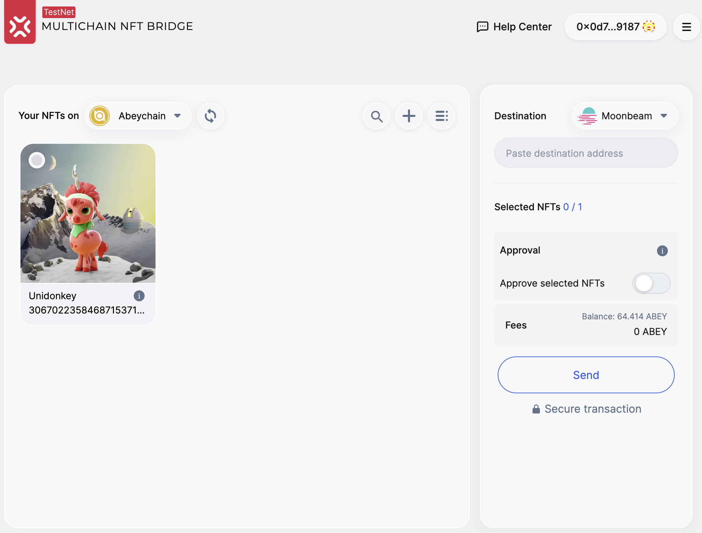
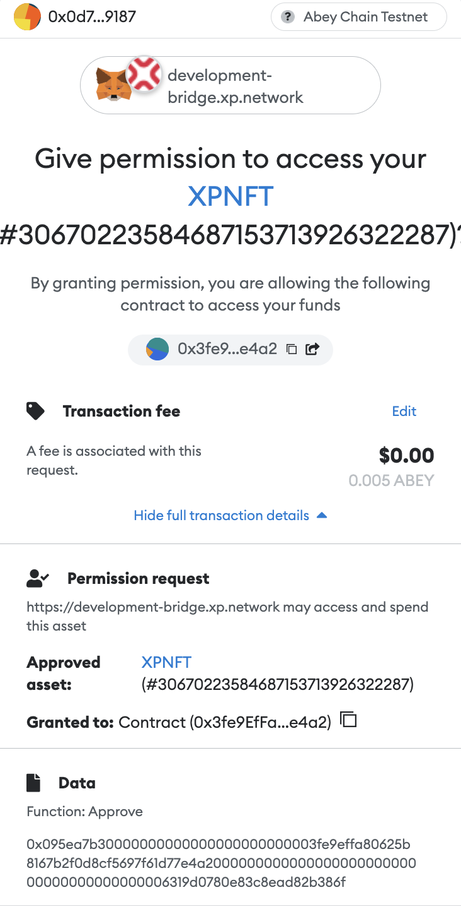
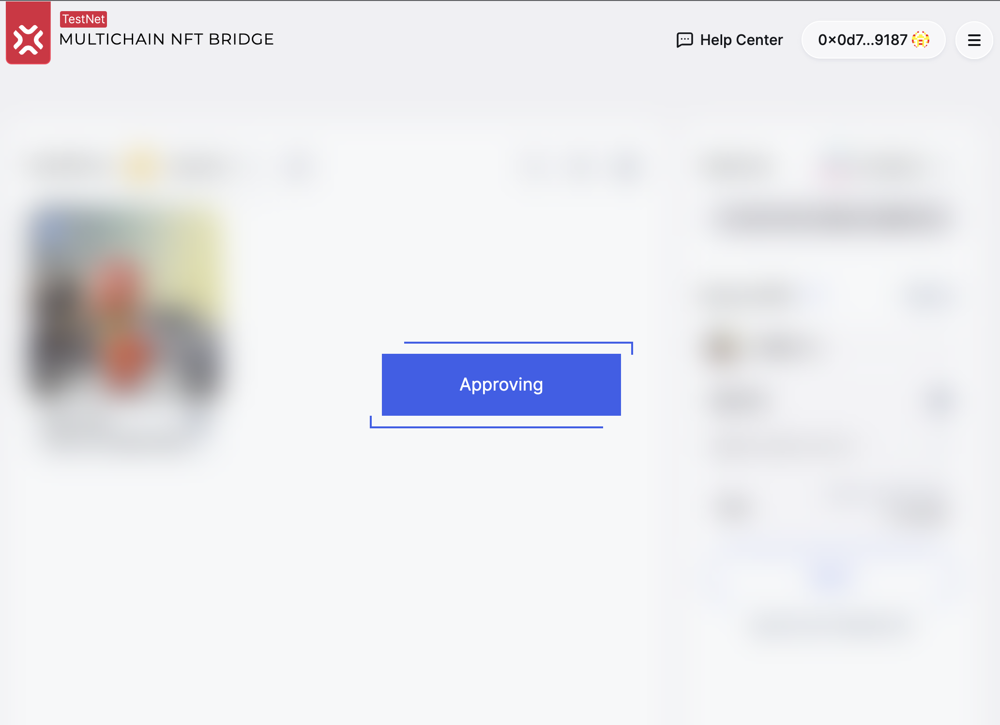
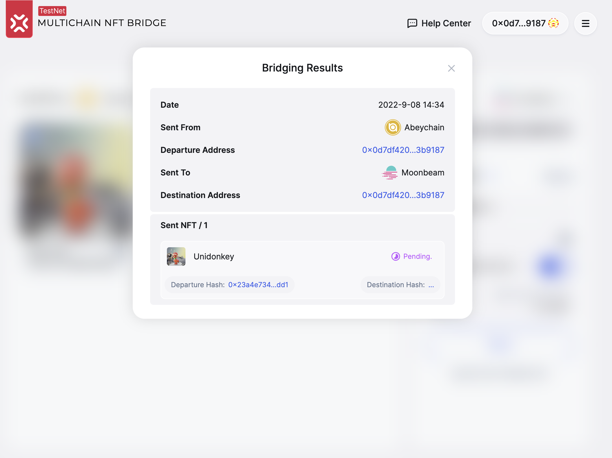
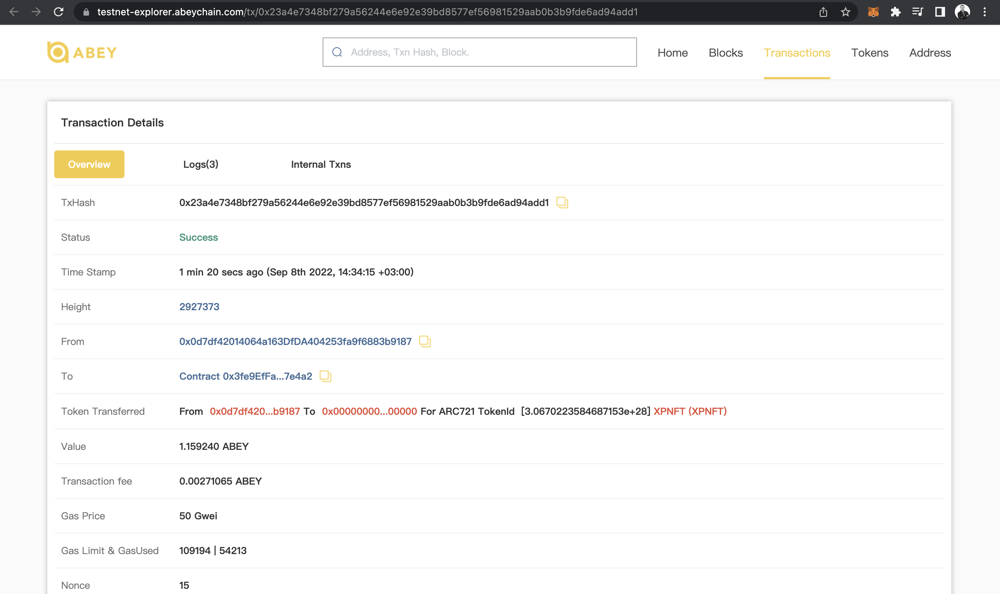
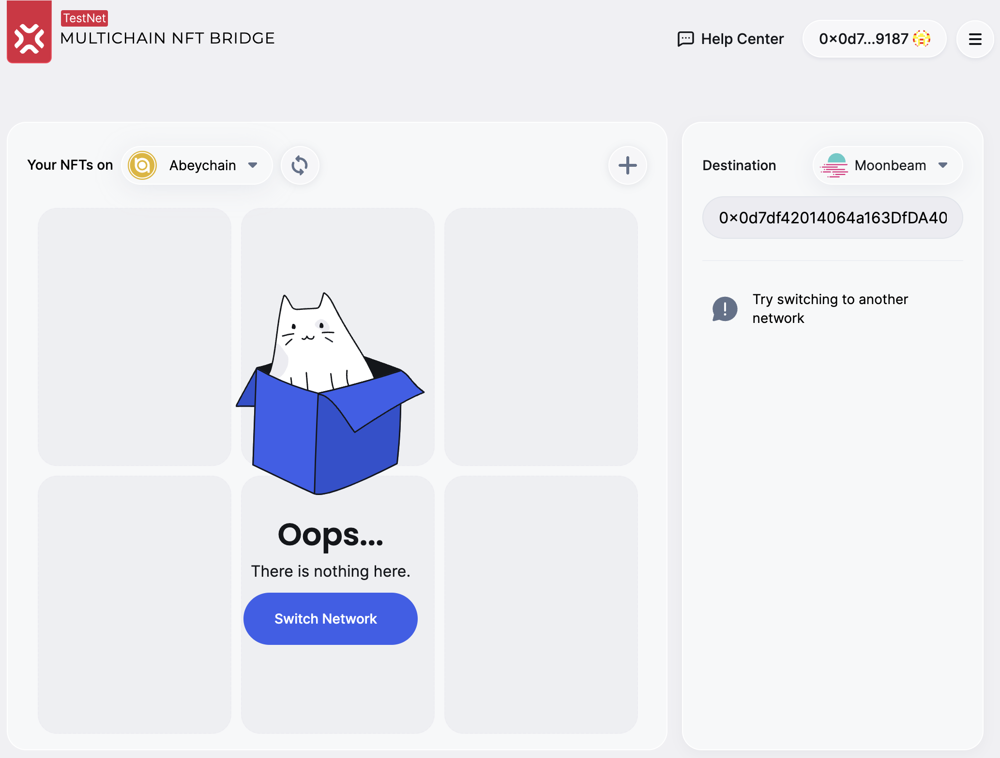

# XP.NETWORK Bridge UI Tutorial

#### 1.6.1 Abeychain is available as a departure or a destination chain

#### 1.6.2 NFT-Indexer in the bridge UI

#### 1.6.3 Transaction fee estimation

In order to see the fee estimation on the chain of destination, select at least one NFT by clicking the top left corner of the NFT Card. The fee estimation is accompanied with the information about the sender's balance.

#### 1.6.4 Apporoval on Abeychain in the bridge

The prerequisites of calling the `approve` transaction are:
1. At least one NFT must be selected
2. The destination address field must be provided

To approve, slide the control to the right from the `Approve selected NFTs` label. 

A Metamask pop-up window will appear suggesting the user to sign the transaction:

The spinner informes the user that the transaction is pending.

After a successful transaction the control will indicate that the bridging transaction has been approved, the `Send` button becomes available for interaction.

#### 1.6.5 transferring an NFT from Abeychain

Click the `Send` button to transfer an NFT from Abeychain to the chain indicated as `Destination`.

Sign the transaction in the wallet of your choice (Metamask, WalletConect, BitKeep).

Once the transaction on the chain of origin is available, the `Bridging Results` pop-up window appears. The links are clickable, openning the corresponding chain explorer where the user account or transaction can be inspected in greater detail.

For example, the departure transaction https://testnet-explorer.abeychain.com/tx/0x23a4e7348bf279a56244e6e92e39bd8577ef56981529aab0b3b9fde6ad94add1 can be viewed on the chain like so:

As a result of a successful transaction, the NFT must dissapear from the NFT Cards View like so:

